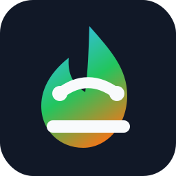

<div align="center">



# LoRA Forge

_✨ Enjoy LoRA training! ✨_

</div>

<p align="center">
  <a href="https://github.com/PineCookie/lora-scripts" style="margin: 2px;">
    
  </a>
  <a href="https://github.com/PineCookie/lora-scripts" style="margin: 2px;">
    
  </a>
  <a href="https://raw.githubusercontent.com/PineCookie/lora-scripts/master/LICENSE" style="margin: 2px;">
    
  </a>
  <a href="https://github.com/PineCookie/lora-scripts/releases" style="margin: 2px;">
    
  </a>
</p>

<p align="center">
  <a href="https://github.com/PineCookie/lora-scripts/releases">Download</a>
  ·
  <a href="https://github.com/PineCookie/lora-scripts/blob/main/README.md">Documents</a>
  ·
  <a href="https://github.com/PineCookie/lora-scripts/blob/main/README-zh.md">中文README</a>
</p>

LoRA & Dreambooth training GUI, script presets, and one-click training environment for [kohya-ss/sd-scripts](https://github.com/kohya-ss/sd-scripts.git)

**WARNING: This project is mainly maintained for personal use. It aims to continue the easy-to-use UI and workflow from [lora-scripts](https://github.com/Akegarasu/lora-scripts), and may currently contain many bugs. Suggestions and PRs are welcome!**

## ✨ New: Anima LoRA Training

- [x] Refactor the UI to support model-specific training parameters, including Anima. Currently Native JS + HTML
- [x] Use uv to install and manage the environment instead of relying on requirements.txt or legacy install scripts
- [ ] Support Torch installation for different GPUs
- [ ] Add missing features from the original frontend


# Usage

### Required Dependencies

Python 3.12 and Git

### Clone repo with submodules

```sh
git clone --recurse-submodules https://github.com/PineCookie/lora-scripts
```

## ✨ LoRA Forge GUI

### Windows

#### Installation

Run `install-cn.ps1` to install dependencies from `pyproject.toml` into a uv-managed `.venv`.

`flash-attn` is optional and is not installed by default. If you have a compatible local wheel, keep it outside Git (for example in an ignored `wheelhouse/` folder), then include the optional extra during sync:

```powershell
uv sync -U --extra flash-attn --find-links .\wheelhouse --no-build-package flash-attn
```

The `-U` flag lets uv update your local lockfile to use the wheel, and `--no-build-package flash-attn` prevents uv from falling back to building `flash-attn` from source.

#### Train

Run `run_gui.ps1`, then open [http://127.0.0.1:28000](http://127.0.0.1:28000) in your browser.
To open the browser automatically, run `python gui.py --open-browser`.

### Linux

#### Installation

Run `install.bash` to install dependencies from `pyproject.toml` into a uv-managed `.venv`.

`flash-attn` is optional and is not installed by default. If you have a compatible local wheel, keep it outside Git (for example in an ignored `wheelhouse/` folder), then include the optional extra during sync:

```sh
uv sync -U --extra flash-attn --find-links ./wheelhouse --no-build-package flash-attn
```

The `-U` flag lets uv update your local lockfile to use the wheel, and `--no-build-package flash-attn` prevents uv from falling back to building `flash-attn` from source.

#### Train

Run `bash run_gui.sh`, then open [http://127.0.0.1:28000](http://127.0.0.1:28000) in your browser.
To open the browser automatically, run `python gui.py --open-browser`.

## Legacy manual training scripts

### Windows

#### Installation

Run `install.ps1` to install dependencies from `pyproject.toml` into a uv-managed `.venv`.

#### Train

Edit `train.ps1`, then run it.

### Linux

#### Installation

Run `install.bash` to install dependencies from `pyproject.toml` into a uv-managed `.venv`.

#### Train

The training script `train.sh` **will not** activate the environment for you. Activate it first.

```sh
source .venv/bin/activate
```

Edit `train.sh`, then run it.

#### TensorBoard

Run `tensorboard.ps1` to start TensorBoard at http://localhost:6006/

## Program arguments

| Parameter Name                | Type  | Default Value | Description                                      |
|-------------------------------|-------|---------------|--------------------------------------------------|
| `--host`                      | str   | "127.0.0.1"   | Hostname for the server                          |
| `--port`                      | int   | 28000         | Port to run the server                           |
| `--listen`                    | bool  | false         | Enable listening mode for the server             |
| `--skip-prepare-onnxruntime`  | bool  | false         | Skip preparing ONNX Runtime                      |
| `--skip-prepare-sd-scripts`   | bool  | false         | Skip cloning kohya-ss/sd-scripts                |
| `--sd-scripts-branch`         | str   | "sd3"         | Branch to clone from kohya-ss/sd-scripts        |
| `--enable-tensorboard`        | bool  | false         | Enable TensorBoard                               |
| `--enable-tageditor`          | bool  | false         | Enable tag editor                                |
| `--tensorboard-host`          | str   | "127.0.0.1"   | Host to run TensorBoard                          |
| `--tensorboard-port`          | int   | 6006          | Port to run TensorBoard                          |
| `--localization`              | str   |               | Localization settings for the interface          |
| `--dev`                       | bool  | false         | Developer mode to disable some checks            |
| `--open-browser`              | bool  | false         | Open the browser after the server starts         |

## Updating sd-scripts

`scripts/sd-scripts` is cloned as its own Git checkout from `kohya-ss/sd-scripts`, not as a parent-repo submodule. The launcher clones it when missing, but it does not auto-update an existing checkout.

To update it to the latest commit on the configured branch:

```powershell
.\update_sd_scripts.ps1
```

```sh
bash update_sd_scripts.sh
```

The default branch is `sd3`. To update from another branch, pass `--branch`, for example:

```powershell
.\update_sd_scripts.ps1 --branch main
```

The updater uses `git pull --ff-only`, so it will stop instead of overwriting local changes.

## Thanks

This project is based on Akegarasu's original [lora-scripts](https://github.com/Akegarasu/lora-scripts) project. Thanks to Akegarasu and the original contributors for building the foundation.
